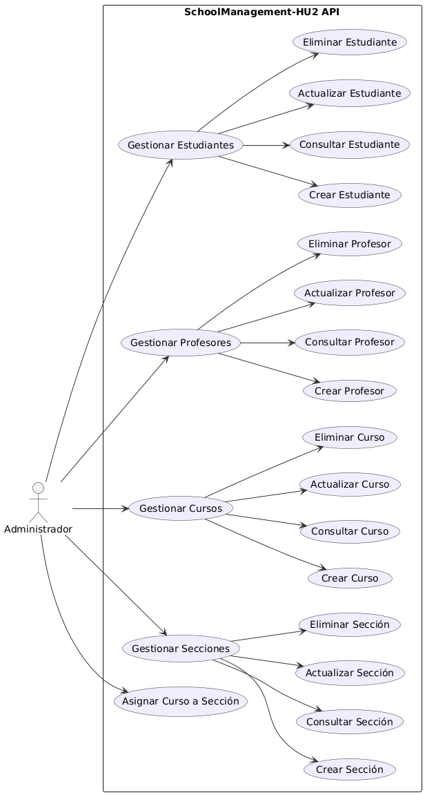
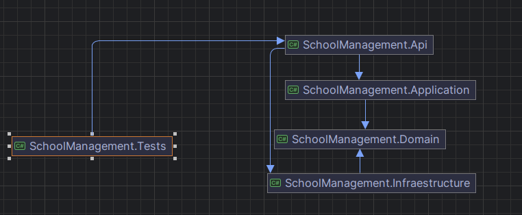

# HU2-C-Sharp.NET

## Descripcion:
Este repo es una api hecha con C# para un sistema de gestion de un colegio
Se usa una estructura por proyectos para facilitar y merjorar el mantinimiento y escalabilidad,
tambien se hicieron pruebas bacicas con Xunit

## Requerimientos:
- Editor de codigo o IDE de tu preferencia
- SDK 8

## Estructura de los proyectos:
```bash
.
├── docker-compose.yml
├── README.md
├── SchoolManagement.Api
│   ├── appsettings.Development.json
│   ├── appsettings.json
│   ├── Controllers
│   │   ├── CourseController.cs
│   │   ├── SectionController.cs
│   │   ├── StudentController.cs
│   │   └── TeacherController.cs
│   ├── Dockerfile
│   ├── Program.cs
│   ├── SchoolManagement.Api.csproj
│   └── SchoolManagement.Api.http
├── SchoolManagement.Application
│   ├── Interfaces
│   │   ├── IStudentService.cs
│   │   └── ITeacherService.cs
│   ├── SchoolManagement.Application.csproj
│   └── Services
│       ├── CourseService.cs
│       ├── SectionService.cs
│       ├── StudentService.cs
│       └── TeacherService.cs
├── SchoolManagement.Domain
│   ├── DTOs
│   │   ├── CourseCreateDto.cs
│   │   ├── CourseReadDto.cs
│   │   ├── SectionCreateDto.cs
│   │   └── SectionReadDto.cs
│   ├── Entities
│   │   ├── Course.cs
│   │   ├── Person.cs
│   │   ├── Section.cs
│   │   ├── Student.cs
│   │   └── Teacher.cs
│   ├── Interfaces
│   │   ├── ICourseRepository.cs
│   │   ├── ISectionRepository.cs
│   │   ├── IStudentRepository.cs
│   │   └── ITeacherRepository.cs
├── SchoolManagement-HU2.sln
├── SchoolManagement.Infraestructure
│   ├── Data
│   │   └── AppDbContext.cs
│   ├── Repositories
│   │   ├── CourseRepository.cs
│   │   ├── SectionRepository.cs
│   │   ├── StudentRepository.cs
│   │   └── TeacherRepository.cs
│   └── SchoolManagement.Infraestructure.csproj
└── SchoolManagement.Tests
    ├── Controllers
    │   └── StudentControllerTest.cs
    ├── Endpoints
    │   ├── CourseEndpointsTest.cs
    │   └── StudentEndpointsTest.cs
    ├── Entities
    │   ├── CourseTest.cs
    │   └── SudentTest.cs
    ├── GlobalUsings.cs
    ├── SchoolManagement.Tests.csproj
    └── Services
        ├── CourseServiceTest.cs
        └── StudentServiceTest.cs

```
## Diagramas:
### Casos de uso:


### Diagrama de clases:


### Diagrama de referencias:


## Roles:
[text](.idea/EVALUACION.md)

## Como ejecutar el proyecto:

### Opcion 1 Ejecucion local:

1. **Clonar el repositorio:**
```bash 
git clone https://github.com/Riwi-Nebula/SchoolManagement-HU2.git
```
*Abrir la carpeta del repositorio*

1. **Restaurar dependencias:**
```bash
dotnet restore
```
2. **Compilar la solucion:**
```bash
dotnet build
```
3. **Ejecutar el proyecto:**
```bash
#Entrar al el proyecto de la api
cd SchoolManagement.Api
dotnet run
```
4. **Probar la Url:**
probar la url en postman o navegador: `http://localhost:5000/api`
usar **Swagger** para probar la url y los endpoints: `http://localhost:5000/swagger`

### Opcion 2 Ejecucion con Docker:

1. **Clonar el repositorio:**
```bash 
git clone https://github.com/Riwi-Nebula/SchoolManagement-HU2.git
```
*Abrir la carpeta del repositorio*

1. **Construir la imagen:**
```bash
docker build -t schoolmanagement-api:dev -f SchoolManagement.Api/Dockerfile .
```
2. **Levantar los servcios definidos en Docker Compose:**
```bash
docker-compose up -d
```
3. **Verificar que el contenedor este corriendo:**
```bash
docker ps
```
4. **Probar la Url**
probar la url en postman o navegador: `http://localhost:3306/api`
usar **Swagger** para probar la url y los endpoints: `http://localhost:3306/swagger`

## Como ejecutar las pruebas:
En la carpeta principal (donde esta el archivo **.sln**) habre la terminal y ejecuta este comando:
```bash
dotnet test
```
